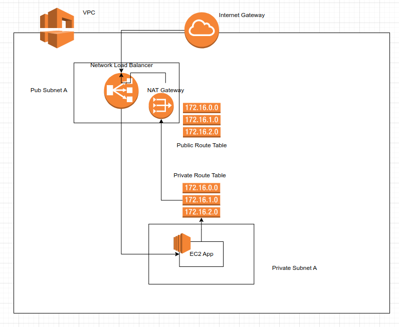

# Week 16 lab

[](https://github.com/warwick-cybersecurity-WM145-24/week-16-lab/actions/workflows/main.yaml)

Week 16 Lab exercises on CI and CD. Using Github actions

This is a rudimentary [Express.js](https://expressjs.com/) based website. Your job is to get the CI fully setup and also the CD to get it deployed to AWS. Make a change and see it re-deployed

## Project structure

```bash
# main project directories
.
├── app
│   ├── app.js                # main application entrypoint
│   ├── lib                   # our hello greetings library
│   ├── routes                # HTTP route logic contained here
│   └── views                 # HTML templates stored here
├── infra
│   ├── deploy.sh             # main cloudformation launch script placeholder
│   └── ec2-user-data.sh      # script to pre-configure your ec2 instance
├── README.md                 # This doc
```

## Development

```bash
# running locally, sits on port 3000 by default
(cd app && DEBUG=* PORT=3000 npm start)
# to test
curl http://localhost:3000/\?language\=gurmukhi
# or launch in browser
firefox http://localhost:3000/?language=gurmukhi

# unit testing
(cd app && npm test)

# linting
(cd app && npm run lint)

# security audit
(cd app && npm aduit)
```

## Your mission

1. [ ] Fork the repo
1. [ ] Get it working locally
1. [ ] implement the missing steps in `.github/workflows/main.yaml`
   1. [ ] Add supply chain scanning and fix any issues
   1. [ ] Add unit testing
1. [ ] Create base infra as per two objectives and target arch below
1. [ ] Get infra scripts and continious deployment working by implementing `/infra/deploy.sh`
1. [ ] Implement the `/about` page and watch it deploy end-to-end



### Objective 1 - get base infra working - get networking and CI working

- [ ] Create VPC: `10.0.0.0/22`
- [ ] Get Github actions to deploy your IaC
- [ ] Create Pub subnet:
  - [ ] a: `10.0.0.0/24`
- [ ] Create Pvt Subnets:
  - [ ] a: `10.0.2.0/24`
- [ ] Create IGW
- [ ] Create Public Route Table
- [ ] Create NAT gateway
- [ ] Create Private Route Table

### Objective 2 - create secondary infra

- [ ] Clickops a `t3.micro` instance in a public subnet with port `22`,`80`,`8080` open and ssh in
  - [ ] Use the `infra/ec2-user-data.sh` script to get your application working on there
  - [ ] `ssh ec2-user@<instance-public-ip>`
- [ ] Delete that instance and script a `t3.micro` instance into the private subnet
- [ ] script a Network load balancer (NLB)
- [ ] Connect load balancer to instance
- [ ] Test application via load-balancer


## Links

- Github actions [getting started](https://docs.github.com/en/actions/quickstart)
- EJS templating [https://ejs.co/]()
- Counterstrike cloudformation [https://github.com/jujhars13/counterstrike-server]()
